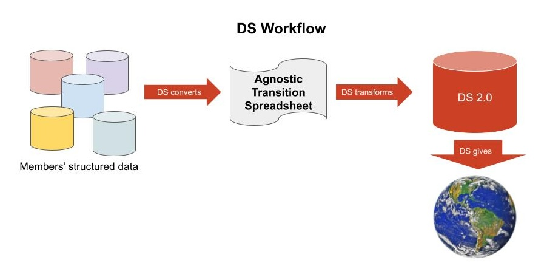

# DS Convert

RubyGem that provides scripts to transform and manage input from multiple sources to generate a DS 2.0 imports CSV. Also includes scripts to extract strings from sources for authority reconciliation.

# Requirements

* Ruby version >= 3.4.0

# Installation

Run

```
gem install ds-convert
```

## Transformation scripts

There are three main scripts:

    ds-convert          # Generate DS import CSV from member source data
    ds-recon            # Extract string values from source data for reconciliation
    ds-validate-csv     # Check DS Import CSV for values with trailing whitespace
    marc-mrc-to-xml.rb  # Utility script to conver MARC MRC files to MARC XML

The `ds-convert` script outputs a standard DS import CSV. Columns names and order are defined in `lib/ds/constants.rb` and can be access via `DS::HEADINGS`.

The `recon` script outputs a number of CSV with extracted values for names (authors, artists, scribe, former owners), places, subjects, and genres (from various vocabularies). CSVs output by `recon` have different columns according the content type.

### `ds-convert` process

Usage:

```
ds-convert convert OPTIONS MANIFEST [SOURCE_DIR]
```

For example,

```
ds-convert convert --output path/to/outputdir/output.csv ../path/to/manifest.csv
```

Given a directory containing a set of source records (MARC XML, DS 1.0
METS, OPenn TEI XML, a CSV) and a `manifest.csv` file, `ds-convert` generates a DS
import CSV for all records listed in `manifest.csv`. The output import
CSV is used by the DS Import scripts to import data into the DS
Wikibase instance.

The values found in the `manifest.csv` are described in the [DS import
manifest data
dictionary](https://docs.google.com/spreadsheets/d/195ItCa2Qg69lp0lMuVlq2eLWJzIAmWHUzDP170_af3I/edit?usp=sharing).
The DS::Manifest::ManifestValidator validates the manifest and the
designated source records. Here is a sample manifest: [manifest.csv](https://github.com/DigitalScriptorium/ds-convert/blob/main/spec/fixtures/marc_xml/manifest.csv).

### `ds-recon` process

Given a list of source files, `ds-recon` generates one or more CSVs listing reconcilable values from the sources, names, subjects, places, etc.

Usage:

```
ds-recon --source-type=TYPE genres FILES
```

Source type is one of `marc-xml`, `tei-xml`, `ds-csv`, or `ds-mets-xml`.

Example:

```
ds-recon genres --source-type=marc-xml --directory=path/to/output_dir/ path/to/marc/*.xml
```

The `ds-recon` subcommands are:

- `write-all` - output all recon CSVs
- `genres` - output `genres.csv`
- `languages` - output `languages.csv`
- `materials` - output `materials.csv`
- `names` - output `names.csv`
- `places` - output `places.csv`
- `subjects` - output `subjects.csv`
- `titles` - output `titles.csv`
- `splits` - output `splits.csv` (see below)
- `validate` - validate a recon CSV for format and well-formedness

Splits: `splits.csv` is an ad hoc list of long lines in source records that exceed the Wikibase 400-character limit for fields. When such long lines occur the data management team splits these lines into smaller chunks and adds them to the [`splits.csv`](https://github.com/DigitalScriptorium/ds-data/blob/main/terms/reconciled/splits.csv).

## Scripts folder

The `/scripts` directory contains utility scripts for managing DS data.

    scripts/
    ├── ds_mets_manifest.rb         # Generate an import manifest for DS METS
    ├── flp_modification_dates.txt  # List of Free Lib TEI mod dates; used by gen-tei-manifest.rb
    ├── gen-tei-manifest.rb         # Generate an import manifest for OPenn TEI
    ├── marc-tag.rb                 # Find marc records by MARC tag/code
    └── run-test-data.sh            # Test ds-recon, ds-convert with all source types

# Development

##  Requirements

* Ruby version >= 3.4.0
* bundler Ruby gem

If you need to install Ruby or a compatible version of Ruby, you can use
[rbenv][rbenv], [rvm][rvm] or the [asdf][asdf] [ruby plugin][asdf-ruby].

[rbenv]: https://github.com/rbenv/rbenv  "rbenv on github"
[rvm]: https://rvm.io  "Ruby Version Manger home"
[asdf]: https://asdf-vm.com/guide/getting-started.html "ASDF getting started"
[asdf-ruby]: https://github.com/asdf-vm/asdf-ruby "ASDF Ruby plugin"

If you don't have the bundler gem installed run:

```shell
$ gem install bundler
```

## Setup

Clone the repository, then:

```shell
cd ds-convert
bundle install
```

Run the Rspec specs to confirm everything is working as expected:

```
bundle exec rspec
```

Generate the API documentation:

```
gem install yard webrick
yard doc  # open doc/index.html
# or run a yard server at http://localhost:8808/
yard server
```

Open `doc/index.html` to view API docs.


### Testing

This project uses rspec for testing. To run the tests:

```
bundle exec rspec
```

### Configuration

#### Institution/QID mappings

TODO: These mappings are probably no longer used. Investigate and remove if possible.

Several of the scripts rely on mappings from institution names to Wikidata QIDs
for CSV output. These have to be entered manually in `config/settings.yml`.

Wikidata QIDs for institutions are mapped to institution names in
`config/settings.yml`. These values are used to create a reverse hash,
`Constants::INSTITUTION_NAMES_TO_QID`, which maps institution names and the
one-word aliases to Wikidata QID URLs.

`config/institutions.yml`:

```yaml
---
institutions:
  Q814779:
    - Beinecke Rare Book & Manuscript Library
    - beinecke
  Q995265:
    - Bryn Mawr College
    - brynmawr
  Q63969940:
    - Burke Library at Union Theological Seminary
    - burke
```

Lists can be any length to allow for a number of variant names. The
preferred name for the institution should be first in the list, and
alias(es) should come at the end. The last item in each list should
be the preferred short name for the institution; e.g., 'beinecke',
'burke', 'penn'.

#### Reconciliation values

Reconciliation CSVs are maintained in git and loaded at runtime.

The file `config/settings.yml` defines the location of the git repository,
path to each reconciliation CSV, and key columns:

```yaml
---
recon:
  local_dir: <%= ENV['DS_DATA_DIR'] || '/tmp' %>
  git_repo: 'https://github.com/DigitalScriptorium/ds-data.git'
  git_branch: main
  git_local_name: ds-data
  iiif_manifests: iiif/legacy-iiif-manifests.csv
  legacy_ia_urls: internet_archive/legacy-ia-urls.csv
  sets:
    - name: names
      repo_path: terms/names.csv
      key_column: name
    - name: genres
      repo_path: terms/genres.csv
      key_column: term
      subset_column: vocabulary
    - name: places
      repo_path: terms/places.csv
      key_column: place_as_recorded
```

Values are:

- `sets`: each CSV set loaded by the `Recon` module
- `name`: name of each set, used by `Recon.find_set(name)`
- `repo_path`: path of the CSV file or files in the repository

# DS Convert Architecture

DS Convert handles two responsibilities within the Digital Scriptorium source-data-to-Wikibase workflow.

## Overall DS data workflow

The overall process from source file to Web publication is shown in the image below.



DS members provide their manuscript data in structured form as METS, MARC, TEI, CSV, or (forthcoming) EAD. That data is then converted to an agnostic DS import spreadsheet, with certain values enhanced by links to authorities, like Wikidata, the Getty Art and Architecture Thesaurus, and OCLC FAST. The import CSV is parsed and loaded into Wikibase. The Wikibase records are then extracted and ingested into the DS Search site.

The _**DS Convert**_ scripts `ds-recon` and `ds-convert` are responsible for the extraction and transformation of structure member data to generate the Agnostic Transition Spreadsheet, referred to here as the DS import CSV.

The full workflow, from source to Web is:

1. Source records for extraction are delivered to the DS data manager (as MARC, CSV, etc.)
2. Reconciliation values are extracted as CSVs from the source records for names, places, languages, etc. (DS Convert's `ds-recon`)
3. The DS data manager reconciles unreconciled values from the extracted reconciliation CSVs and adds them to the [DS data dictionaries][DS Data Dictionaries].
4. The data manager generates a manifest listing all manuscript records to be extracted form the source.
5. The manifest, the data dictionary CSVs, and source data are used to generate the import CSV (DS Convert's `ds-convert`)
6. The generated import CSV is loaded Wikibase by the data manager (DS Import service, not publicly available)
7. The Wikibase data is exported and staged for ingest into the DS Search application (DS Import service)
8. The DS Search application downloads and converts exported Wikibase JSON as Solr records

[DS Data Dictionaries]: https://github.com/DigitalScriptorium/ds-data/tree/main/terms/reconciled "DS Data Dictionaries"\

## DS Convert workflow

The DS Convert scripts `ds-recon` and `ds-covert` are responsible for the extraction of reconciliation CSVs data and the generation DS import CSVs from source data provided by DS members. In more detail:

- `ds-recon` performs the extraction of values, like, names, places, and languages from sources that are to be reconciled with authorities and added to the DS [authority data dictionaries][DS Data Dictionaries], and
- `ds-convert` generates the import CSV from source records, enhancing those records with authority values from the project data dictionaries

## DS Convert components

The main work of `ds-recon` and `ds-convert` is done by extractors: [DS::Extractor::TeiXml][TEI Extractor], [DS::Extractor::DsMetsXmlExtractor][METS Extractor], [DS::Extractor::DsCsvExtractor][CSV Extractor], and [DS::Extractor::Extractor::MarcXmlExtractor][MARC Extractor]

[CSV Extractor]: lib/ds/extractor/ds_csv_extractor.rb "DS::Extractor::DsCsvExtractor"
[MARC Extractor]: lib/ds/extractor/marc_xml_extractor.rb "DS::Extractor::Extractor::MarcXmlExtractor"
[METS Extractor]: lib/ds/extractor/ds_mets_xml_extractor.rb "DS::Extractor::DsMetsXmlExtractor"
[TEI Extractor]: lib/ds/extractor/tei_xml_extractor.rb "DS::Extractor::TeiXml"

These classes are responsible for extracting reconciliation and manuscript description values from source files.

Separate modules are responsible for transforming the extracted data as either reconciliation CSVs or an import CSV.
Reconciliation transformations are managed by the [Recon][Recon] module and its components.

The `ds-convert` process is more complex and comprises several modules:

- [Mappers][Mappers] that generate hashes for each source record (i.e., each manuscript description) using extractors
- Format-specific [Extractors][Extractors] that extract data from source files (MARC XML, DS CSV, etc.)
- A [Convertor][Convertor] that orchestrates the mapping and collects hashes for output as an import CSV
- A [Manifest][Manifest] that lists all records in a data source and provides information to a record locator (see below)
- Record locators, like [DS::Extractors::XmlRecordLocator][XmlRecordLocator]), that are used by a mapper to retrieve records for hash generation
- [Sources][Sources] that are responsible for open and returning parse source files _in the format expected by a mapper_ (see below)

[Extractors]: lib/ds/extractor
[Recon]: lib/ds/recon.rb "DS Recon module"
[Mappers]: lib/ds/mapper "DS Record mappers"
[Convertor]: lib/ds/converter/converter.rb "DS Converter"
[Manifest]: lib/ds/manifest "DS Manifest classes"
[Sources]: lib/ds/source "DS Sources"
[XmlRecordLocator]: lib/ds/extractor/xml_record_locator.rb "DS::Extractors::XmlRecordLocator"


### A note on Sources
A note on `DS::Source`: A source is used by a mapper to request a parsed source file; for example, a MARC XML file as a Nokogiri::XML document. The primary motivation for the Source is its inclusion of the [SourceCache](lib/ds/source/source_cache.rb), which is responsible for caching open source files. This is useful for source files that have many records and are slow to open and parse, as for DS CSVs and MARC XML files, which may have a thousand or more records.
